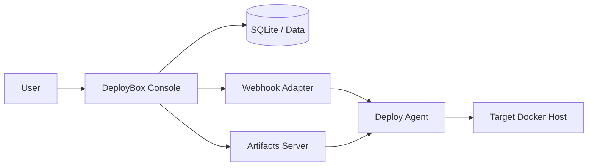
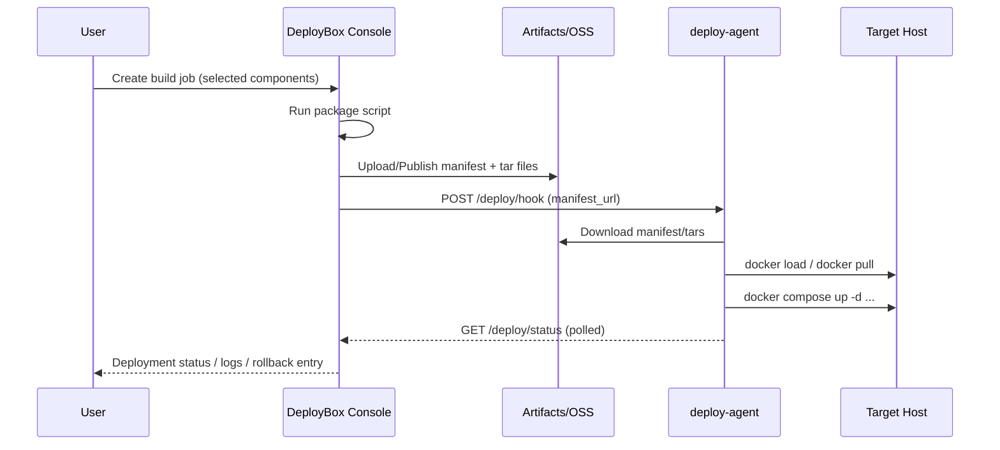

# DeployBox

<p align="center">
  <strong>Open-source release control plane for Docker / Docker Compose projects.</strong>
</p>

<p align="center">
  <a href="./README.md">English</a> |
  <a href="./README.zh-CN.md">简体中文</a>
</p>

[](#)
[](#)
[](#)
[](#license)

DeployBox standardizes **project onboarding**, **artifact packaging**, **versioned releases**, and **remote deployment tracking** in one lightweight control plane.

It is built for teams that need practical release operations without introducing heavyweight CI/CD infrastructure.

## Features

- Multi-project release management in one console
- Component-based releases (ship only images you selected)
- Compose-aware onboarding (import service candidates from `docker-compose.yml`)
- Built-in artifact flow (`manifest.json` + image tar)
- Async deployment tracking, logs, and rollback entry
- Supports local artifact server and OSS
- Private OSS bucket support through deploy-agent credentials
- Paginated build / deployment / release lists in project detail

## Architecture



## Release Sequence



## Repository Layout

- `app/`: FastAPI application and templates
- `docker-compose.yml`: local stack (`deploy-console` + `artifacts`)
- `Dockerfile`: deploy-console image build
- `requirements.txt`: Python dependencies
- `data/`: local SQLite data
- `dist/releases/`: local artifacts
- `docs/`: supplementary docs

## Quick Start

1. Create env file:

```bash
cp .env.example .env
```

2. Update required values in `.env`:

- `DEPLOY_CONSOLE_SECRET_KEY`
- `DEPLOY_CONSOLE_ADMIN_USERNAME`
- `DEPLOY_CONSOLE_ADMIN_PASSWORD`
- `DEPLOY_CONSOLE_WORKSPACE_HOST_PATH`
- `DEPLOY_CONSOLE_PACKAGE_ARTIFACT_PUBLIC_BASE_URL`

3. Start DeployBox:

```bash
docker compose up -d --build
```

4. Open console:

```text
http://127.0.0.1:18101
```

## Core Configuration

- `DEPLOY_CONSOLE_WORKSPACE_HOST_PATH`
  Host workspace root for onboarded projects (real folders or symlinks).
- `DEPLOY_CONSOLE_WORKSPACE_PATH`
  Workspace path inside container. Default: `/workspace`.
- `DEPLOY_CONSOLE_PACKAGE_SCRIPT`
  Default package script relative to project workspace. Default: `deploy/scripts/package_release.sh`.
- `DEPLOY_CONSOLE_PACKAGE_ARTIFACT_BASE_URL`
  Internal URL from console to local artifact server.
- `DEPLOY_CONSOLE_PACKAGE_ARTIFACT_PUBLIC_BASE_URL`
  Public URL reachable by remote `deploy-agent`.
- `DEPLOY_CONSOLE_LOCAL_ARTIFACTS_PATH`
  Local artifacts root inside deploy-console. Default: `/artifacts/releases`.
- `USE_OSS`
  Global artifact backend switch.

## Artifact Modes

- `auto`: follows global `USE_OSS`
- `local`: force local artifact server
- `oss`: force OSS upload

Important:

- `artifact_public_base_url` is a project-level build setting, not an environment-level setting
- it is only used when generating release URLs for `local` artifact mode
- when `oss` is used, final manifest artifact URLs are rewritten to OSS locations

Recommended:

- dev / staging: `local` (or `auto` with `USE_OSS=false`)
- production: explicit `oss`

## Onboarding Workflow

1. Create a project (`name`, `slug`, workspace path, registry prefix)
2. Import component candidates from `docker-compose.yml`
3. Review Compose readiness report and optional recommended compose
4. Maintain component metadata (`service_name`, image, dockerfile, context, build mode)
5. Configure environment endpoints (`webhook_url`, `status_url`, `shared_secret`)
6. Build release and deploy asynchronously

Project detail behavior:

- build jobs, deployment jobs, and releasable releases are independently paginated
- starter preview is collapsed by default and can be expanded on demand
- importing component candidates from compose requires confirmation before overwriting existing component settings

## Compose Best Practices

To ensure deployed containers actually switch to new release images:

- Prefer `image:` for releasable services
- Avoid release-time `build:` for production deployment
- Wire image to `DEPLOY_IMAGE_<SERVICE>`
- Avoid source bind mounts that override image filesystem (example: `./backend:/app`)
- Avoid floating tags (`latest`) for business images

Current DeployBox behavior:

- build-enabled components are normalized toward versioned image tags
- if a build-enabled component still uses `:latest`, DeployBox rewrites it to `:__VERSION__`
- generated release versions use `YYYYMMDD-HHMM-<shortsha>` when Git is available
- when Git metadata is unavailable, versions fall back to `YYYYMMDD-HHMM` without a `-local` suffix

Example:

```yaml
services:
  backend:
    image: ${DEPLOY_IMAGE_BACKEND:-registry.example.com/myapp-backend:latest}
```

`deploy-agent` injects `DEPLOY_IMAGE_<SERVICE>` automatically from the release manifest so the deployment uses exact release images. After `docker compose up -d` succeeds, deploy-agent also tags the same images as each repository's `:latest`, so a bare `docker compose up -d` after reboot falls back to the most recent successful image.

The deployment detail page shows the exact images injected for the release and the stable `latest` tags maintained by deploy-agent, which makes restart and compose-recreate issues easier to diagnose.

## Pre Compose Up Steps

For migrations or other one-off operations that must run before `docker compose up -d`, configure a generic hook in `deploy/release.config.json`:

```json
{
  "release_hooks": {
    "pre_compose_up": [
      {
        "name": "db_migrate",
        "service": "backend",
        "command": ["python", "manage.py", "migrate", "--noinput"],
        "timeout_seconds": 300,
        "required": true
      }
    ]
  }
}
```

deploy-agent only accepts array commands and runs them through `docker compose run --rm --no-deps <service> ...`. If a required step fails, deployment stops before `compose up`, stable `latest` tags are not updated, and the deployment detail page shows the hook result.

## deploy-agent Setup

Starter bundle includes:

- `deploy/deploy-agent/Dockerfile`
- `deploy/deploy-agent/deploy-agent.compose.yml`
- `deploy/deploy-agent/deploy-agent.env.example`
- `deploy/deploy-agent/bin/deploy-release.sh`

Minimal startup:

```bash
cd deploy/deploy-agent
cp deploy-agent.env.example deploy-agent.env
docker compose -f deploy-agent.compose.yml up -d --build
```

Critical envs:

- `DEPLOY_PROJECT_ROOT=/workspace`
- `DEPLOY_PROJECT_WORKSPACE_HOST_PATH=/absolute/host/project/path`

For private OSS buckets:

- `DEPLOY_OSS_ACCESS_KEY_ID`
- `DEPLOY_OSS_ACCESS_KEY_SECRET`
- `DEPLOY_OSS_BUCKET_NAME`
- `DEPLOY_OSS_ENDPOINT`
- `DEPLOY_OSS_REGION`

Notes:

- Use the real host path, not a container path
- On Docker Desktop, add this path to File Sharing
- DeployBox uses it for both mount and `docker compose --project-directory`
- New OSS releases include object-key metadata, and deploy-agent downloads tar files from private OSS with OSS SDK first
- Older releases still fall back to `image_tar_url`

Webhook behavior:

- DeployBox sends both `manifest_url` and inline `manifest_json` to deploy-agent
- this avoids requiring deploy-agent to fetch a private manifest before deployment starts

## Deployment Trigger Timeout

- Trigger requests to `webhook_url` now use a longer dedicated timeout than generic read requests
- if the trigger request takes too long, DeployBox marks the deployment as submitted and continues status polling in the background
- this is intended to reduce user confusion when deploy-agent eventually succeeds after a slow trigger phase

## Development

Normal:

```bash
docker compose up -d --build
```

After dependency / Dockerfile changes:

```bash
docker compose build --no-cache deploy-console
docker compose up -d deploy-console
```

## Roadmap

- Stronger Compose lint and compatibility checks
- Kubernetes / Helm adapters
- Richer audit and approval workflow
- More storage backends and CDN integration

## Contributing

Issues and PRs are welcome. Focus areas:

- deployment reliability
- onboarding UX
- release observability
- adapter extensibility

## License

MIT
