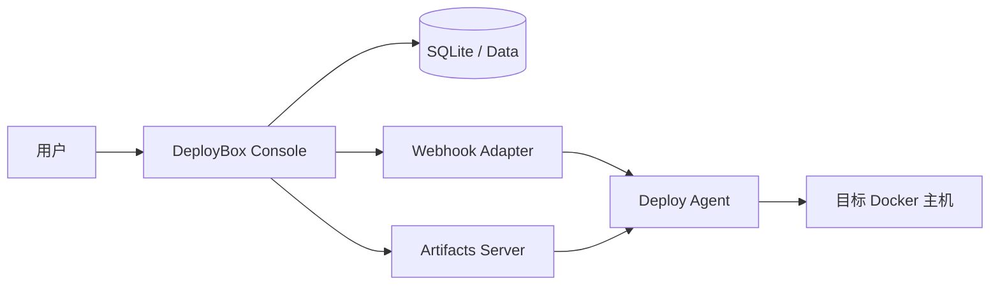
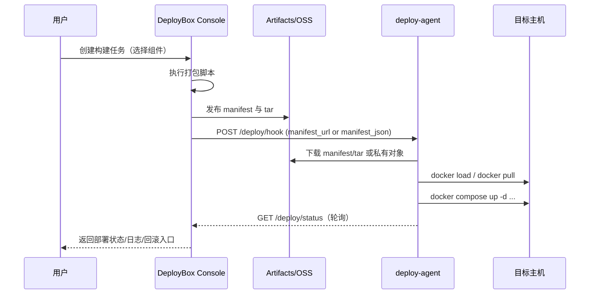

# DeployBox

<p align="center">
  <strong>面向 Docker / Docker Compose 项目的开源发布控制平面。</strong>
</p>

<p align="center">
  <a href="./README.md">English</a> |
  <a href="./README.zh-CN.md">简体中文</a>
</p>

[](#)
[](#)
[](#)
[](#license)

DeployBox 将**项目接入、制品打包、版本发布、远端部署跟踪**整合在一个轻量控制台中。

它面向希望快速落地发布流程、但不想引入重型 CI/CD 平台的团队。

## 核心特性

- 在一个控制台管理多个项目和发布流程
- 组件级发布（只发布本次变更的镜像）
- 支持从 `docker-compose.yml` 导入组件候选
- 内置制品链路（`manifest.json` + 镜像 tar）
- 异步部署跟踪、日志查看、回滚入口
- 支持本地制品站、Aliyun OSS、Amazon S3
- 支持多用户、固定角色、项目级权限绑定与审计留痕
- 支持项目级默认制品仓库绑定
- 内置项目治理、质量检查、自动巡检与趋势面板

## 系统架构



## 发布时序



## 仓库目录

- `app/`：FastAPI 应用与页面模板
- `docker-compose.yml`：本地启动编排（`deploy-console` + `artifacts`）
- `Dockerfile`：deploy-console 镜像构建文件
- `requirements.txt`：Python 依赖
- `data/`：本地 SQLite 数据
- `dist/releases/`：本地制品目录
- `docs/`：补充文档

## 快速开始

1. 创建环境变量文件：

```bash
cp .env.example .env
```

2. 修改 `.env` 关键项：

- `DEPLOY_CONSOLE_SECRET_KEY`
- `DEPLOY_CONSOLE_ADMIN_USERNAME`
- `DEPLOY_CONSOLE_ADMIN_PASSWORD`
- `DEPLOY_CONSOLE_WORKSPACE_HOST_PATH`
- `DEPLOY_CONSOLE_PACKAGE_ARTIFACT_PUBLIC_BASE_URL`

3. 启动 DeployBox：

```bash
docker compose up -d --build
```

4. 访问控制台：

```text
http://127.0.0.1:18101
```

5. 首次默认管理员：

- 系统首次启动时，会自动使用 `DEPLOY_CONSOLE_ADMIN_USERNAME` 和 `DEPLOY_CONSOLE_ADMIN_PASSWORD` 创建初始管理员
- 该用户会自动带上 `system_admin` 角色
- 如果数据库里该用户名已经存在，则不会重复创建，只会确保它仍具备管理员角色
- 因此首次部署前应显式设置强密码，并妥善保管

## 关键配置说明

- `DEPLOY_CONSOLE_WORKSPACE_HOST_PATH`
  宿主机工作区根目录（可是真目录或软链接目录）。
- `DEPLOY_CONSOLE_WORKSPACE_PATH`
  容器内工作区路径，默认 `/workspace`。
- `DEPLOY_CONSOLE_PACKAGE_SCRIPT`
  默认打包脚本（相对于项目工作区），默认 `deploy/scripts/package_release.sh`。
- `DEPLOY_CONSOLE_PACKAGE_ARTIFACT_BASE_URL`
  控制台容器访问本地制品站的内部地址。
- `DEPLOY_CONSOLE_PACKAGE_ARTIFACT_PUBLIC_BASE_URL`
  远端 `deploy-agent` 可访问的公开地址。
- `DEPLOY_CONSOLE_LOCAL_ARTIFACTS_PATH`
  控制台容器内本地制品目录，默认 `/artifacts/releases`。
- `USE_OSS`
  全局 OSS 兼容开关。若项目未绑定数据库内仓库，仍可回退到这组环境变量。
- `DEPLOY_CONSOLE_SECRET_ENCRYPTION_KEY`
  用于加密数据库内仓库密钥；未设置时会退回基于 `DEPLOY_CONSOLE_SECRET_KEY` 的派生值。
- `DEPLOY_CONSOLE_ADMIN_USERNAME`
  首次启动时用于初始化默认管理员用户名。
- `DEPLOY_CONSOLE_ADMIN_PASSWORD`
  首次启动时用于初始化默认管理员密码。

## 制品模式

- `auto`：跟随全局 `USE_OSS`
- `local`：强制本地制品站
- `oss`：强制 OSS

从本版本开始，控制台还支持在“设置 → 制品仓库”中维护数据库级仓库池，并在项目上绑定默认仓库：

- `aliyun_oss`
- `amazon_s3`

当项目已绑定默认仓库时，`auto/oss` 会优先使用项目仓库；未绑定时才回退到全局环境变量。

建议：

- 开发/测试：`local`（或 `USE_OSS=false` 下使用 `auto`）
- 生产：显式使用 `oss`

## 项目接入流程

1. 创建项目（`name`、`slug`、工作区路径、镜像仓库前缀、默认制品仓库）
2. 从 `docker-compose.yml` 导入组件候选
3. 查看 Compose 规范检查，按需下载推荐 compose
4. 维护组件元数据（`service_name`、image、dockerfile、context、构建模式）
5. 配置环境（`webhook_url`、`status_url`、`shared_secret`）
6. 生成 release 并异步部署

## Compose 发布规范建议

为确保容器实际切换到新镜像：

- 可发布服务优先使用 `image:`
- 生产发布链路尽量不依赖 `build:`
- 用 `DEPLOY_IMAGE_<SERVICE>` 引用发布镜像
- 避免源码挂载覆盖镜像文件系统（如 `./backend:/app`）
- 业务镜像避免长期使用 `latest`

示例：

```yaml
services:
  backend:
    image: ${DEPLOY_IMAGE_BACKEND:-registry.example.com/myapp-backend:latest}
```

`deploy-agent` 会根据 manifest 自动注入 `DEPLOY_IMAGE_<SERVICE>`。

## deploy-agent 接入

starter 包会生成：

- `deploy/deploy-agent/Dockerfile`
- `deploy/deploy-agent/deploy-agent.compose.yml`
- `deploy/deploy-agent/deploy-agent.env.example`
- `deploy/deploy-agent/bin/deploy-release.sh`

最小启动方式：

```bash
cd deploy/deploy-agent
cp deploy-agent.env.example deploy-agent.env
docker compose -f deploy-agent.compose.yml up -d --build
```

关键变量：

- `DEPLOY_PROJECT_ROOT=/workspace`
- `DEPLOY_PROJECT_WORKSPACE_HOST_PATH=/宿主机项目绝对路径`

如果 release 制品位于私有对象存储，还需要按 provider 填写对应凭证：

- Aliyun OSS：
  `DEPLOY_OSS_ACCESS_KEY_ID`、`DEPLOY_OSS_ACCESS_KEY_SECRET`、`DEPLOY_OSS_BUCKET_NAME`、`DEPLOY_OSS_ENDPOINT`、`DEPLOY_OSS_REGION`
- Amazon S3：
  `DEPLOY_S3_ACCESS_KEY_ID`、`DEPLOY_S3_SECRET_ACCESS_KEY`、`DEPLOY_S3_BUCKET_NAME`、`DEPLOY_S3_ENDPOINT`、`DEPLOY_S3_REGION`

新协议下，DeployBox 会优先把 `manifest_json` 直接随 webhook 一起发送；deploy-agent 会根据 manifest 中的 `artifact_storage` 和对象 key 下载私有制品。

## 用户与设置

控制台新增了统一的“设置”页面，用于管理：

- 用户与固定角色
- 项目级角色绑定
- 制品仓库
- 语言偏好
- 系统级超时与路径设置
- 自动质量巡检策略
- 审计日志

当前内置角色包括：

- `system_admin`
- `onboarding_admin`
- `build_admin`
- `release_admin`
- `audit_viewer`

角色模型说明：

- `system_admin` 为全局管理员
- `onboarding_admin`、`build_admin`、`release_admin`、`audit_viewer` 可以按项目范围绑定
- 因此可以把同一个用户只授权到某一个或几个项目，避免全局放权

## 质量治理

DeployBox 当前已经内置第一版项目治理能力，重点覆盖“谁负责、发布前检查什么、系统是否处于可发布状态”。

当前能力包括：

- 项目级治理配置
  - 项目负责人
  - 发布负责人
  - 风险级别
  - 发布检查清单
  - 治理备注
- 手动质量检查
  - 在项目详情页执行
  - 结果入库并关联审计日志
- 自动质量巡检
  - 启动后由控制台后台线程按周期执行
  - 可在设置页启用/关闭，并配置巡检间隔分钟数
- 质量趋势面板
  - Dashboard 展示最近质量检查、趋势柱状图和近 7 天失败巡检数
  - 项目详情页展示项目级趋势和检查历史

当前质量检查覆盖项包括：

- 项目负责人是否已指定
- 发布负责人是否已指定
- 发布检查清单是否已维护
- 项目工作区是否可用
- 构建模板是否已配置
- 是否存在启用中的组件
- 是否存在构建型组件
- 是否已配置部署环境
- 是否已绑定默认制品仓库

说明：

- 自动巡检目前采用“单实例进程内后台调度”实现，适合当前 DeployBox 的单实例部署模式
- 如果后续改成多实例部署，建议再升级为集中调度或加分布式去重

注意：

- 必须填写宿主机真实路径，不是容器内路径
- Docker Desktop 需要把该目录加入 File Sharing
- DeployBox 会用该路径做挂载和 `docker compose --project-directory`

## 本地开发

常规启动：

```bash
docker compose up -d --build
```

依赖或 Dockerfile 有变化时：

```bash
docker compose build --no-cache deploy-console
docker compose up -d deploy-console
```

## Roadmap

- 更强的 Compose 规范检查与兼容性分析
- Kubernetes / Helm 适配器
- 更细粒度的审计与审批能力
- 更多存储后端与 CDN 集成

## 参与贡献

欢迎提交 Issue 与 PR，重点方向：

- 部署可靠性
- 接入体验
- 可观测性
- 适配器扩展能力

## License

MIT
